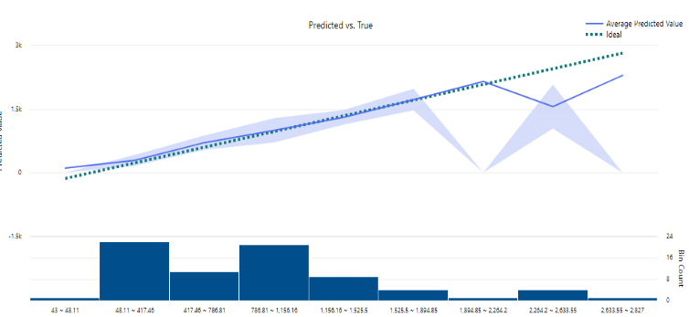

# 🚴‍♂️ Bike Rental Prediction using Azure Machine Learning

## 📒 Descrição
Este projeto é um Laboratório para aprendizado acerca do Azure Machine Learning. utilizou-se o Azure ML para prever a quantidade de bicicletas alugadas com base em dados históricos. O objetivo é aplicar técnicas de aprendizado de máquina para melhorar a precisão das previsões de aluguel.

## 🧐 Processo de Criação
O projeto foi desenvolvido em várias etapas, utilizando o recurso de Automated Machine Learning (AutoML) do Azure. Abaixo estão os passos principais da configuração:

### Etapas:
1. **Iniciar um novo trabalho AutoML**: Acesse a página Automated ML no Azure Machine Learning Studio e crie um novo trabalho com configurações básicas.
2. **Configurar o conjunto de dados**: Crie um novo conjunto de dados a partir de arquivos locais, definindo o nome e a descrição, e escolha o armazenamento adequado (Azure Blob Storage).
3. **Definir as configurações da tarefa**: Selecione o tipo de tarefa (regressão) e configure a coluna alvo, as métricas e os modelos permitidos (RandomForest e LightGBM).
4. **Selecionar recursos de computação**: Escolha o tipo de computação (Serverless) e configure o tipo e tamanho da máquina virtual.
5. **Executar o trabalho**: Submeta o trabalho e aguarde a conclusão.

## 🚀 Resultados
Os resultados do projeto incluem várias métricas de desempenho que indicam a eficácia do modelo na previsão de aluguéis. Abaixo estão os resultados mais relevantes:

| Métrica                                | Valor       |
|----------------------------------------|-------------|
| Explained variance                     | 0.78142     |
| Mean absolute error                    | 186.75      |
| Mean absolute percentage error         | 36.947      |
| Median absolute error                  | 113.23      |
| Normalized mean absolute error         | 0.054799    |
| Normalized median absolute error       | 0.033225    |
| Normalized root mean squared error     | 0.090849    |
| Normalized root mean squared log error | 0.058501    |
| R2 score                               | 0.78138     |
| Root mean squared error                | 309.61      |
| Root mean squared log error            | 0.41162     |
| Spearman correlation                   | 0.91913     |

## 💭 Reflexão
Este projeto demonstrou a capacidade do Azure Machine Learning em automatizar o processo de criação de modelos preditivos. Os resultados obtidos indicam que o modelo é eficaz, com uma explicação de variância superior a 78%, o que é promissor para previsões futuras. Além disso, as métricas de erro sugerem que há espaço para melhorias, especialmente na redução do erro absoluto.

Não foi possível criar os endpoints para executar testes e fornecer aqui os resultados, porém, o aprendizado foi bastante promissor. Uma vez que se trata de uma ferramenta com certa facilidade de uso (no-code/low-code).

Caso tenha interesse em aprender, siga o passo a passo: https://microsoftlearning.github.io/mslearn-ai-fundamentals/Instructions/Labs/01-machine-learning.html

## 📊 Histograma
Abaixo esta o histograma gerado para visualizar melhor os resultados:

### Predição vs. Ideal

